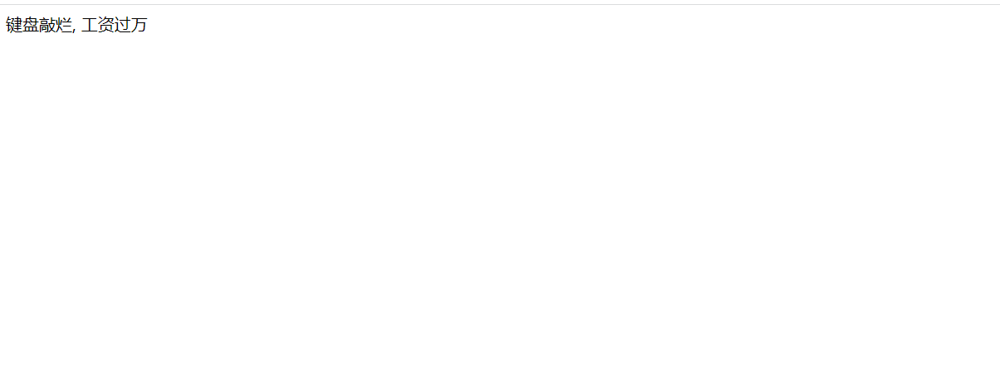
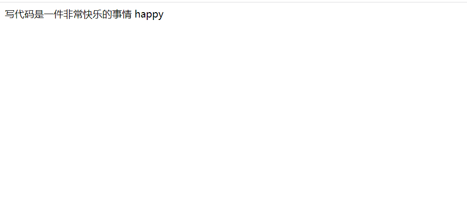
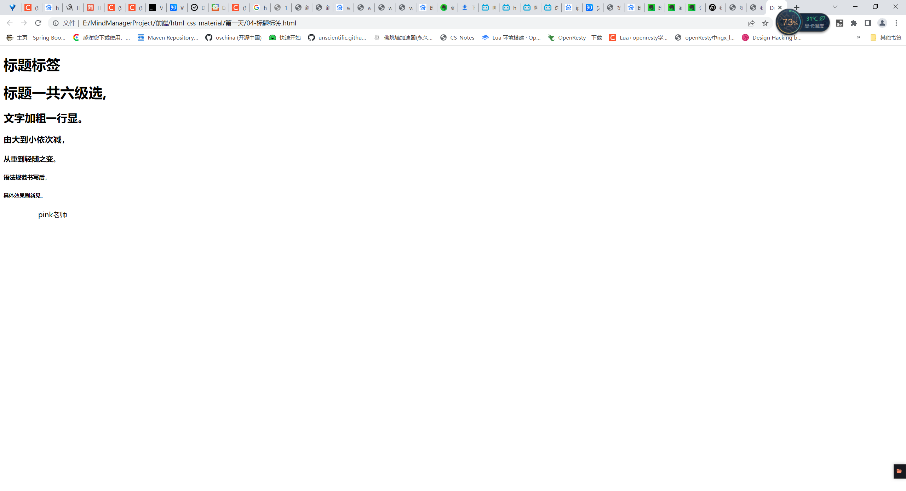

## 1. Day01

### 1.1. HTML 语法规范

#### 1.1.1. 源码

```html
<html> 
   <head></head>
   <body></body>
</html>
<br />
```

### 1.2. 第一个页面

#### 1.2.1. 源码

```html
<html>
   <head>
	<title> 第一个页面</title>
    </head>
    <body>
       键盘敲烂, 工资过万
    </body>
</html>
```

#### 1.2.2. 页面渲染图

### 1.3. VSCODE创建页面

#### 1.3.1. 源码

```html
<!DOCTYPE html>
<html lang="zh-CN">
<head>
    <meta charset="UTF-8">
    <meta name="viewport" content="width=device-width, initial-scale=1.0">
    <meta http-equiv="X-UA-Compatible" content="ie=edge">
    <title>我利用vscode创建的第一个页面</title>
</head>
<body>
    写代码是一件非常快乐的事情  happy
</body>
</html>
```

#### 1.3.2. 页面渲染图




### 1.4. 标题标签

#### 1.4.1. 源码

```html
<!DOCTYPE html>
<html lang="en">
<head>
    <meta charset="UTF-8">
    <meta name="viewport" content="width=device-width, initial-scale=1.0">
    <meta http-equiv="X-UA-Compatible" content="ie=edge">
    <title>Document</title>
</head>
<body>
    <h1>标题标签</h1>
    <h1>标题一共六级选,</h1>
    <h2>文字加粗一行显。</h2>
    <h3>由大到小依次减，</h3>
    <h4>从重到轻随之变。</h4>
    <h5>语法规范书写后，</h5>
    <h6>具体效果刷新见。</h6>
    　　        ------pink老师

</body>
</html>
```

#### 1.4.2. 页面渲染图


